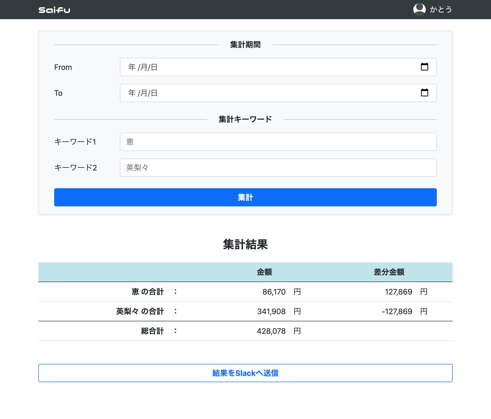

# saifu


zaimを使用した家計精算システムです。  
共働き家庭にて、特定期間に使用した金額を2人で折半することができます。



## できること
- zaimから特定期間のレコードを取得、折半金額の計算
- Slackへ通知

## 使用方法
### 日々の記録
- zaimで家計簿を入力する
    - 登録する際、コメント欄にGroupByしたいキーワードを入れておく
### 精算
- Saifuで期間とキーワードを入力し集計
- キーワードでGroupByされた合計金額と、折半金額が出力される
    - キーワードに一致しないレコードは別途出力されるため、確認してzaimにて修正する
- 必要に応じてSlackへ通知する

## 動作方法
### 動作環境
- Java 1.8
### 事前準備
- [Zaim Developer](https://dev.zaim.net/) でのアプリケーション登録
- Slack Webhook URLの取得
#### 環境変数
以下の環境変数の設定が必要です。
- ZAIM_CONSUMER_KEY
    - 登録したアプリのコンシューマID
- ZAIM_CONSUMER_SECRET
    - 登録したアプリのコンシューマシークレット
- SAIFU_SLACK_URL
    - Slack Webhook URL
### 動作方法
```
./gradlew build
./gradlew bootRun
```
